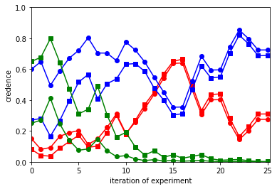

# Illustrates the washing out theorem.

The washing out theorem (or one of them) says that, for any Bayesians, if they perform an experiment often enough and their priors in the true hypothesis are not zero, then their posteriors in the true hypothesis will likely end up close to 1 (and therefore also close to each other). The `plot_washing_out()` function plots how Bayesians credences evolve, so lets you visualize washing out.

## Example

Mount Stromboli is a volcano off the north coast of Sicily. Creed and Angela, who recently left office jobs to become volcanologists, have been studying it. They've come up with three geological models, but they're not sure which is right and they disagree between themselves about how plausible they are. They use the models to predict how many times Mount Stromboli will erupt in any given month. The table shows the likelihoods on each model, as well as Creed and Angela's priors (in that order).


|                     | 0  | 1  | 2  | 3  | >=4 |
|---------------------|----|----|----|----|-----|
| .08 / .15 : Model 1 | .1 | .3 | .3 | .2 | .1  |
| .27 / .60 : Model 2 | .2 | .2 | .2 | .2 | .2  |
| .65 / .25 : Model 3 | .2 | .4 | .1 | .1 | .2  |


As it happens, Model 2 is correct. Creed and Angela observe the volcano over several years, seeing how many times it erupts each month and updating their credences by Bayes Rule.

The function `plot_washing_out()` simulates this process and plots how Creed and Angela's credences in the models evolve.

```
>>> from washing_out import *
>>> priors = np.array([[8/100, 15/100], [27/100, 60/100], [65/100, 25/100]])
>>> likelihoods = np.array([[.1, .3, .3, .2, .1], [.2, .2, .2, .2, .2], [.2, .4, .1, .1, .2]])
>>> true_likelihoods = [.2, .2, .2, .2, .2]
>>> reps = 25
>>> plot_washing_out(priors, likelihoods, true_likelihoods, reps)
>>> plt.show()
```

<p align="center">

</p>

The square markers are Creed's credences and the circular markers are Angela's. The colors red, blue, green correspond to Models 1, 2, and 3. As you see, after a couple of years Creed and Angela's credences in the true model (Model 2) have ended up close to 1 and to each other. So the plot illustrates the washing out theorem.

## Extras

For a less busy image, you can specify whose credences in which hypotheses to plot, using the optional `which` parameter. It accepts a tuple of two tuples: the first says which hypotheses to plot; the second says which agents' credences to plot.

For example, here's how to plot only Creed's credences in Models 1 and 2:

```
>>> which = ((0, 1), (0,))
>>> plot_washing_out(priors, likelihoods, true_likelihoods, reps, which=which)
>>> plt.show()
```

You can also customize the appearance using the `marker_styles` and `colors` parameters, which each accept a list of strings.